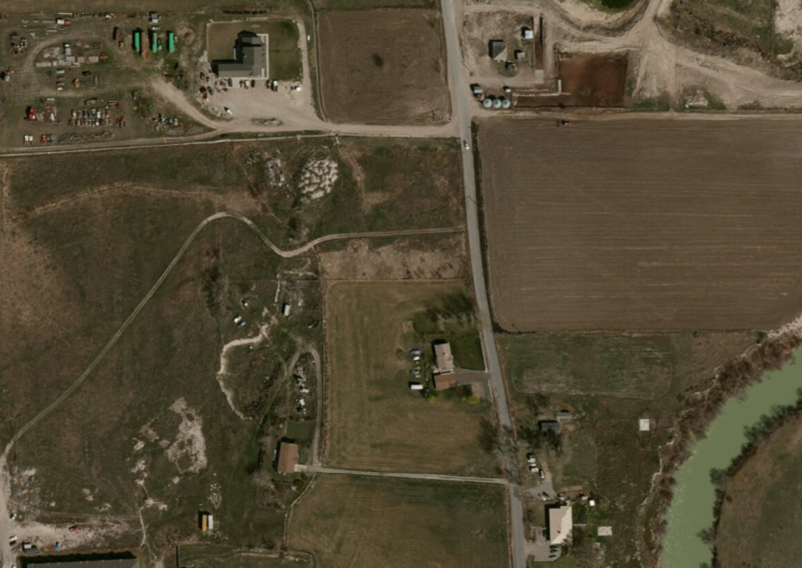
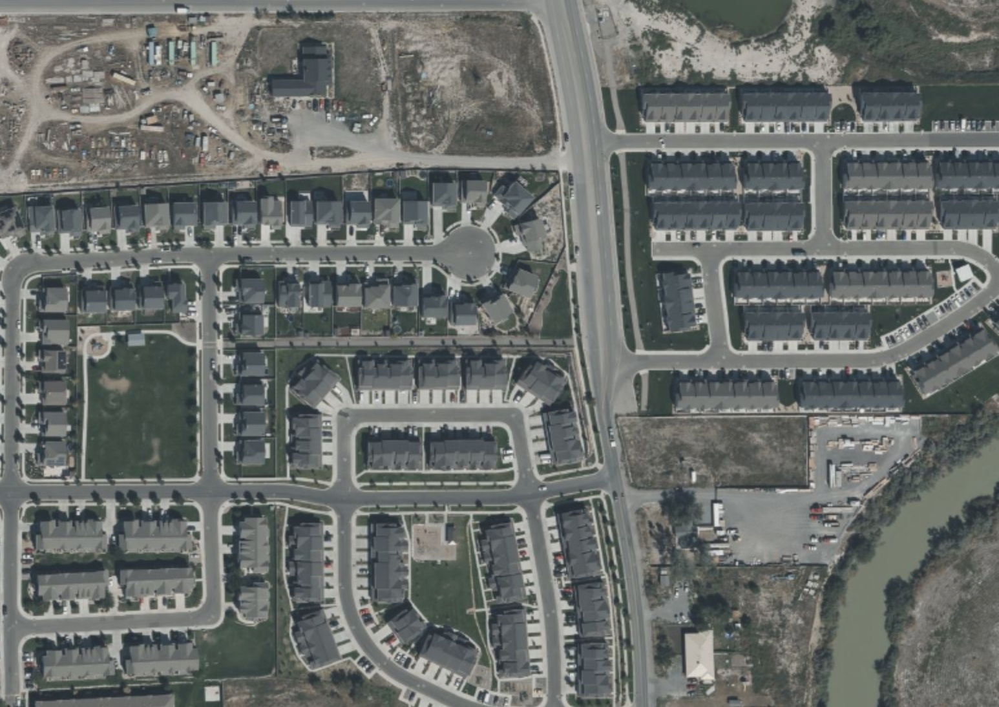
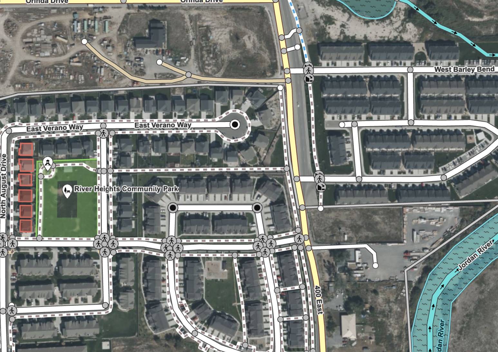
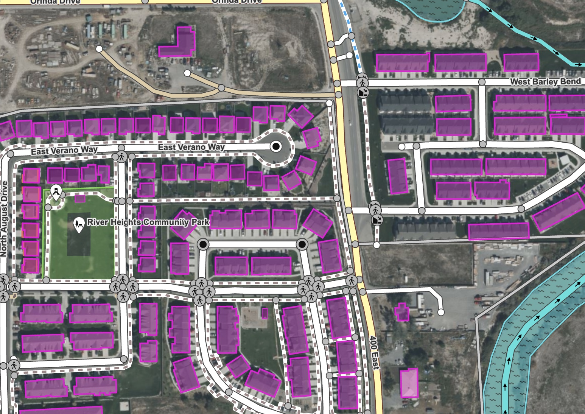

Utah is one of the fastest growing states in the U.S. If you live in or around the Wasatch Front or Saint George, you cannot miss the new subdivisions, apartments and condos being built everywhere. Check this area in Saratoga Springs, just a few years ago:

And more recently:

For us mappers this means a lot of new things to add to OSM. Fortunately we have a very active local community, and all of the roads and sidewalks are already mapped in this area:

What is mostly missing is the buildings. You can see that a few were added on the left side of the screenshot (the brown / red boxes) but most of the buildings that appear in the aerial image, are not on the map yet. 

Mapping buildings is tedious: you have to follow the outline of each building to make the polygon, then tag it and ideally make it square as well. Fortunately, there are tools to help. Let's look at one: the [Rapid editor](http://rapideditor.org), made my Meta / Facebook. The Rapid website has this to say about it:

> Rapid integrates advanced mapping tools, authoritative geospatial open data, and cutting-edge technology to empower OpenStreetMap mappers at all levels to get started quickly, making accurate and fresh edits to maps.

So what are these 'advanced mapping tools' and how are they going to help us map new developments in Utah more efficiently?

The most most powerful tool that Rapid editor offers that no other editor has, is the ability to quickly add buildings. When we open Rapid at our Saratoga Springs location, we see the OSM data, but also purple boxes outlining the buildings we would like to add!

It turns out that Rapid uses building polygons that were extracted from aerial imagery using machine learning techniques. A few big companies do this type of work and release the data for free. Rapid uses the [open buildings dataset from Microsoft](https://github.com/microsoft/GlobalMLBuildingFootprints). 

Turning buildings from this purple layer to actual OpenStreetMap data is easy. Here are the steps:

1. Select the purple building from the Microsoft source data
2. Click on "Use this feature" in the left toolbar

That's it! Make sure you check that the outline provided matches the actual building outline you see on the imagery in the editor and make adjustments as needed after you add the building to OSM.

A few tips to help you map even more efficiently with Rapid and understand the process:

1. You can also use the keyboard shortcut "A" to add the selected building to OSM
2. The Microsoft data gets refreshed frequently, but for very recent housing developments, there may not be data to add using this method.
3. In rare cases, there could already be an OSM building where Rapid suggests a building to add. Be careful not to add duplicates.
4. You can only add 50 buildings at a time this way before you are forced to upload your changes. This is to help prevent mindless copy-pasting.

Rapid has more tricks up its sleeve, but this is one we use the most by far here at OSM Utah! 

**Join us for our next Map Night in Salt Lake City! We would love to have you! Find the details and RSVP on our [Our Events](https://new.osmutah.org/our-map-nights/).** **See you soon!**
