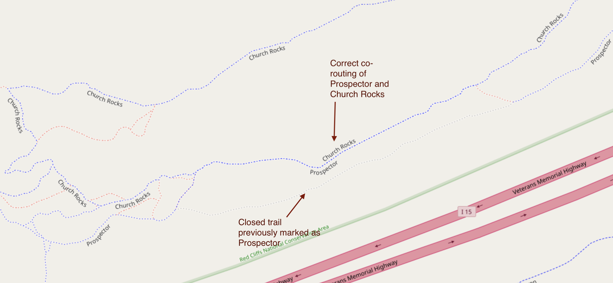
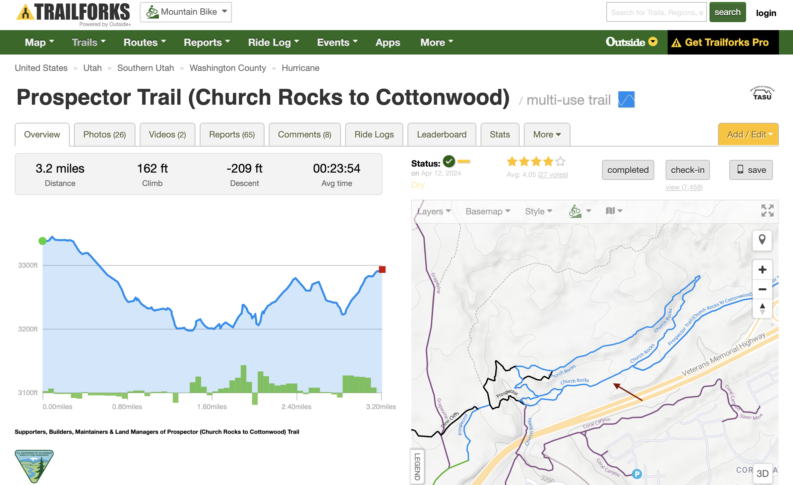
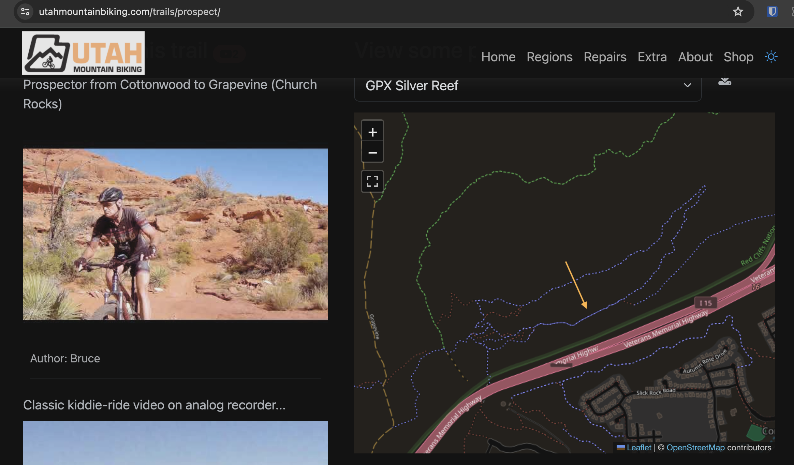
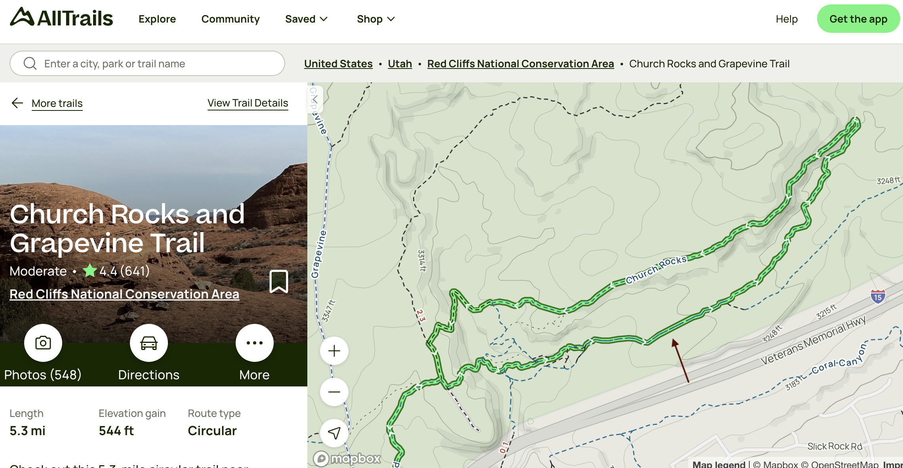

As part of OpenStreetMap US' [Trails Stewardship Initiative](https://openstreetmap.us/our-work/trails/) pilot, we have been improving trail data in southern Utah to help reduce ecological and archeological impact from recreation, and to prevent trail user rescues.  My hometown in southwest Utah is well known for Zion National Park, but we are also an increasingly popular destination for outdoor recreation on the surrounding public lands, in particular mountain biking.  One of those multi-use areas is the Red Cliffs Desert Reserve, a 60,000+ acre preserve established to protect the endangered [Mojave desert tortoise](https://www.fws.gov/species/desert-tortoise-gopherus-agassizii). The reserve is comprised of state park, state trust, Bureau of Land Management [National Conservation Area](https://www.blm.gov/programs/national-conservation-lands/utah/red-cliffs-nca) lands, with co-management by the various entities.  Red Cliffs contains more than 130 miles (and counting) of official trail and trailless routes, with varying jurisdictions and access rules, at times along a single route.

Because a number of the designated mountain bike trails cross broad slickrock sections, it doesn't take long for alternative trails to develop.  Some of these alternative trails have been blessed by land managers as official unnamed routes, but others have been signed as closed.  Unfortunately, without active digital trail stewardship, closed trails can inadvertently get marked in OpenStreetMap as official routes.

One example is the western end of Prospector Trail, which weaves on and off of Church Rocks Trail.  The maze of routes in this area required a ground inspection of signage to sort out official trail routing.  I found that in OpenStreetMap, a segment of Prospector had been following a trail signed as closed (although the sign had been knocked down).  The closed trail cut through habitat that is more favorable to the desert tortoise, while the official slickrock route was far less impactful. After shoring up the sign, I corrected the routing in OpenStreetMap. 

*In OSM edit mode, you can see the faint closed trail below, and the new co-routing of the Prospector/Church Rocks Trails.*

While it will take some time to update all trail apps/sites that ingest OSM data, a few of the mountain bike sites using embedded OpenStreetMap updated immediately.

*Trailforks uses embedded OpenStreetMap, which immediately corrected the trail routing, and removed the closed trail.*

*Utah Mountain Biking website also immediately reflected the change.*

AllTrails also displayed the correction after a few weeks.

*The AllTrails map now displays the corrected trail routing.*

This change helped to emphasize what impact my participation in the [Trails Stewardship Initiative](https://openstreetmap.us/our-work/trails/) could have on the environment.  If you would like to volunteer for the next phase of the Utah rollout, there is [an information session](https://www.americantrails.org/training/the-openstreetmap-us-trails-stewardship-initiative) on August 22nd from 11:00 am - 12:30 pm Mountain Time.
