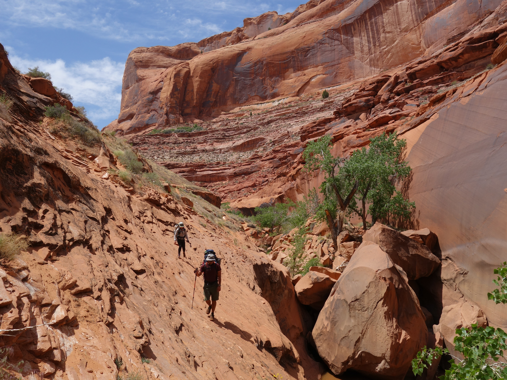
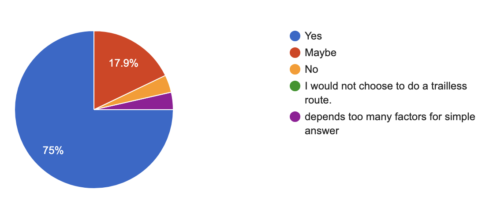
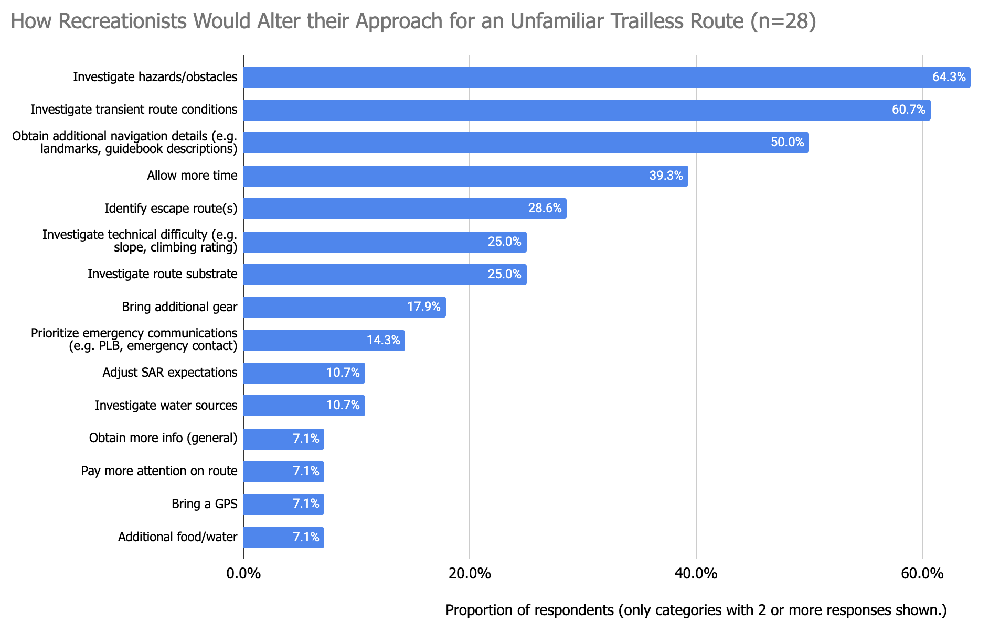
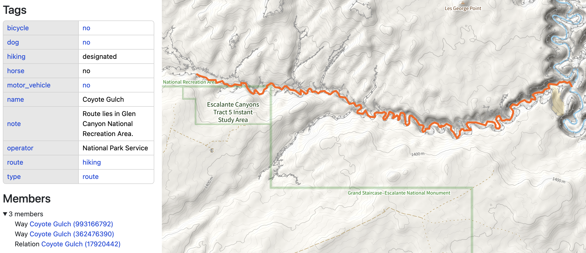
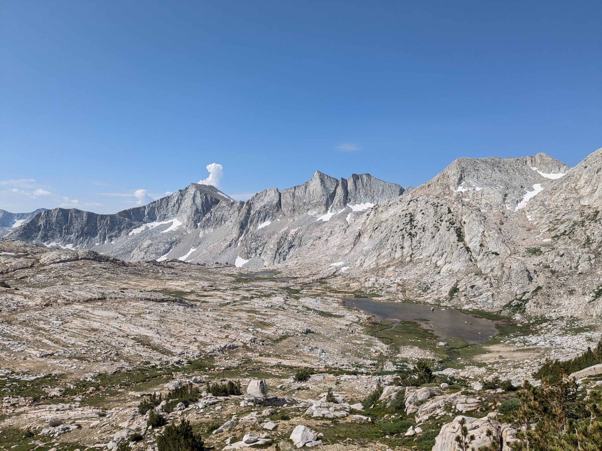

## What is a trailless route?

With the proliferation of online outdoor recreation information, there has been an increase in the popularity of trailless routes. Unfortunately, this has also resulted in increased ecological impact and SAR incidents.  Trailless routes are routes which lack an established trail and may vary over time in the safest, least impactful path of travel.  This could be due to temporal conditions, such as tidal changes or snowfields, or geologic reasons, such as the route being in a seasonal or permanent waterway.  Some land agencies refer to these as “primitive routes”, and may include them as official routes, or as unofficial routes described in agency documentation.

In OpenStreetMap trailless routes are distinct from unmaintained or infrequently maintained trails, which technically have (or had) a defined path, but may now be challenging to navigate due to overgrowth, washouts, or fallen trees.  Examples of trailless routes in Utah, include the popular [Coyote Gulch](https://www.nps.gov/glca/planyourvisit/coyote-gulch.htm) in Glen Canyon National Recreation Area and [Lower Spring Canyon](https://www.nps.gov/care/planyourvisit/springcanyon.htm) in Capitol Reef National Park.

*Coyote Gulch, an official trailless route in Glen Canyon NRA*

## Risk management on trailless routes

The [Trails Stewardship Initiative](https://openstreetmap.us/our-work/trails/) aims to standardize land management agency published route data to reduce impacts on the environment, archeological sites, and SAR teams.  As part of this effort, OSM maintainers have been discussing how best to represent trailless routes and what that signals to map users. 

To inform this effort, we conducted a survey of outdoor recreationists.  The objective was to better understand how preparation differed between unfamiliar trailless and trailed routes.  28 respondents were recruited from the OSM US Slack #trails channel and the outdoor enthusiast website, [backcountrypost.com](http://backcountrypost.com). 

The respondents were likely more experienced than the general hiker population in terms of trailless experience (75% being very experienced or experienced).  Respondents were asked if they would alter their risk management approach for an unfamiliar 10-mile trailless route versus an unfamiliar trailed route.  75% said that they would.

*The proportion of respondents who would or would not alter their risk management plan for a 10-mile, unfamiliar trailless route versus a trailed route.*

Respondents were asked to describe how they would alter their risk management approach.  The open-ended responses were categorized.  The top 5 categories were as follows:

- Investigate general hazards/obstacles (e.g. chockstones, sections requiring scrambling) - 64.3%
- Investigate transient route conditions (e.g. brush, snow, water levels) - 60.7%
- Obtain additional navigation details (e.g. location of landmarks, guidebook details)  50.0%
- Allow more time - 39.3%
- Identify escape route(s) - 28.6%

Even though our pool of respondents was likely more experienced with trailless routes than the general population of hikers, this data underscores the need to provide visual differentiation between trailed and trailless routes.  It also serves as a recommendation to third-party trail apps that they should strongly consider adding supplemental information and adjust time estimates to set realistic user expectations for trailless routes.

Lastly, nine (32.1%) respondents provided optional feedback for OSM US/Trails Stewardship Initiative.  Of those 6 (66.7%) advised against publishing trailless routes for environmental impact and safety reasons.  Several respondents also recommended against using a linear visual treatment for trailless routes, which could be easily confused by third-party app users as a trail.

## Trailless route mapping best practices

For those interested in helping with OSM route data standardization, the recommended mapping approach for land agency published trailless routes that lie in seasonal or permanent washes is through route relations rather than overlaying a `highway=path` on top of a natural feature.  Access attributes can be applied to the route relation, similar to a path. This approach also helps to deemphasize social trails along stream/river banks. Here’s an example for the [Coyote Gulch trailless route](https://www.openstreetmap.org/relation/17920443), an official Glen Canyon NRA route:

*Coyote Gulch trailless route relation and metadata*

There has been an ongoing discussion on the OSM forum for how best to handle trailless routes that cross less defined natural features (e.g. alpine talus fields). If you would like to weigh in, [here's the thread](https://community.openstreetmap.org/t/have-a-tag-to-denote-fictional-pathless-paths-that-exist-only-for-routing-purposes/113615).

Finally, it's also worth considering whether the environmental and SAR impacts outweigh the benefits of mapping unofficial trailless routes, like Steve Roper's classic Sierra High Route. Roper described the route's wildness as follows: *High Route adventurers will not be put off by the lack of an actual trail, since much of the singular joy of cross-country travel lies in wandering through the timberline country as the pioneers did--wondering what the next turn will reveal.* Arguably, mapping an artificial path, which may in turn lead to a social trail, detracts from that wilderness experience.

*A trailless section of the Sierra High Route*
