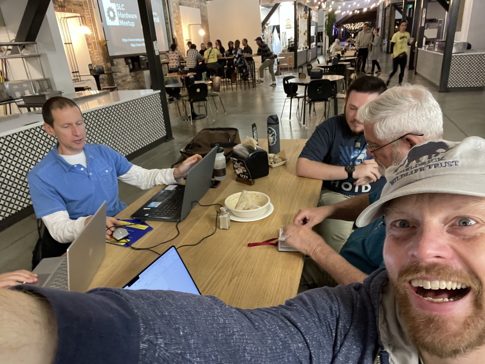
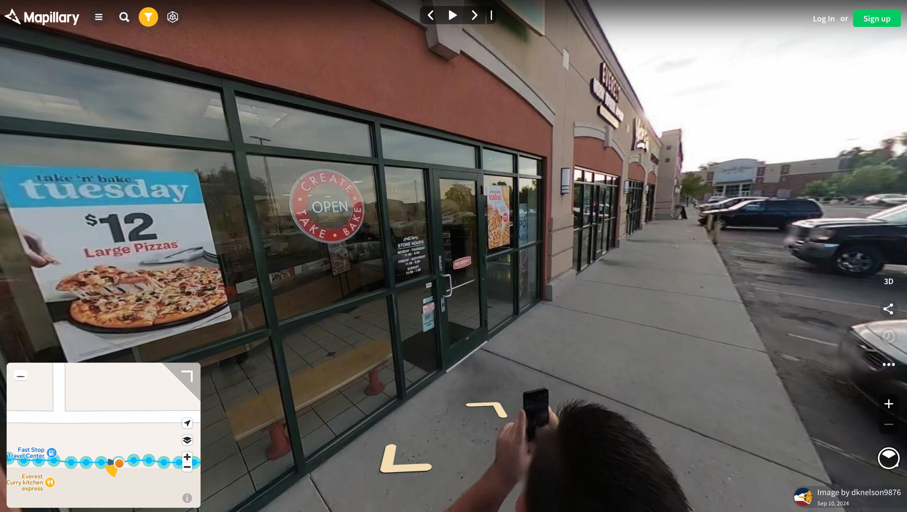
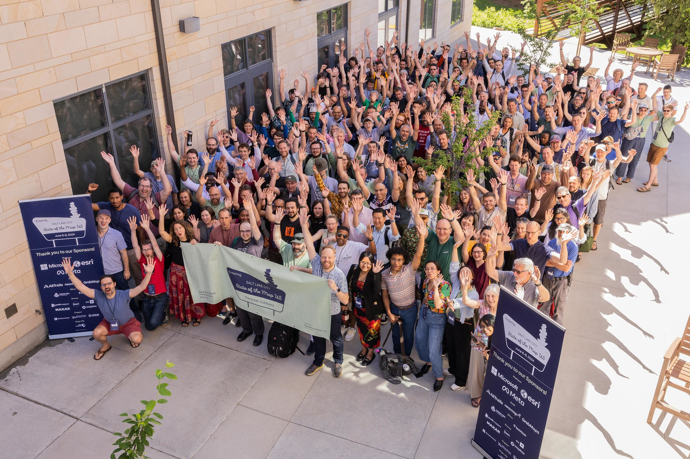
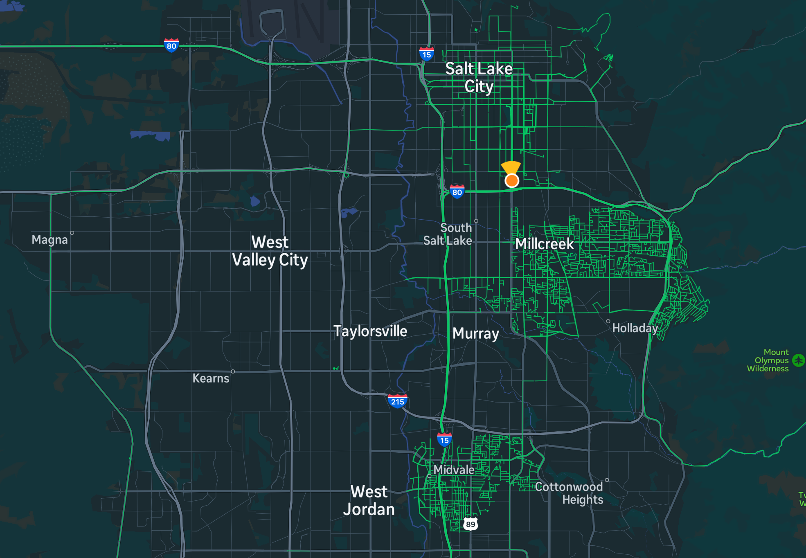

As the year draws to a close, OSM Utah is looking back on a very good year, with more mapping and social events than ever in its 13-year history! We feel in a celebratory mood, and want to share some of our 2024 highlights with you. Happy Mapping!

## Map Nights

We held a Map Night every month this year! Our Map Nights are informal events where anyone interested in OSM is welcome to learn, chat about maps, work on collaborative mapping projects, and get to know the community. We have a crowd of about 4 "regulars" and new people joining from time to time. We would love to welcome more new mappers in 2025. If you have never joined us before, why not make it your 2025 new year's resolution to do so! You'll be in good company, and our regular meeting location [Woodbine Food Hall](https://www.woodbineslc.com) has great and affordable food options. (The "Oh Schnitzel" sandwich from Deadpan Sandwiches is a OSM Utah favorite.)

## Mapillary Camera

We started [lending our very own GoPro Max 360 degree "action camera"](https://new.osmutah.org/2024/07/mapillary-imagery-for-openstreetmap-in-utah/) to members who are interested in using it to capture Mapillary imagery to enhance OpenStreetMap. Mapillary is a powerful crowdsourced street-level image platform where anyone can upload images taken by cameras such as the GoPro Max or just any regular cellphone with a camera. If you are interested in getting your hands on this camera, join one of our [future meetups](https://new.osmutah.org/our-map-nights/)!

## State Of The Map US

We were very proud to host the annual State of the Map U.S. OpenStreetMap conference right here on the University of Utah campus in Salt Lake City. With more than 250 attendees and dozens of talks, workshops and mapping events, it was a highlight of the year for OSM Utah and the OpenStreetMap community in the entire United States and beyond!

## Trails Stewardship Initiative

OpenStreetMap United States kicked off their [Trails Stewardship Initiative](https://openstreetmap.us/our-work/trails/), a collaboration of government, volunteer, and private sector stakeholders working to address issues in trail mapping, outdoor recreation, and public land management. The first project launched out of this new initiative is aimed at improving trail maps at various National Parks and National Forests right here in Utah! 

Want to help out? Explore the [Utah trails projects](https://tasks.openstreetmap.us/explore?campaign=Utah+Trail+Campaign+%28TSI%29&omitMapResults=1) on the OSM US Tasking Manager web site!

## Some Mapping Stats

A lot of mappers edited OSM in Utah in 2024! If you are among them, we thank you and hope that you will continue to contribute to what is already the best map of Utah!

We saw more than **3,500 edit sessions by new mappers** this year, up from just over 2,000 last year. This is out of a total of more than 32,000 total edit sessions to the Utah map overall. 

1,700 map edit sessions were made using [MapRoulette](http://maproulette.org), the tasking tool that lets you find interesting small tasks to work on around the world.

Nearly 3,000 edit sessions included changes to **restaurants, bars, schools, shops and other points of interest**. More than 13,000 editing sessions included one or more updates to **roads, footpaths, parking and other infrastructure**. Around 4,700 editing sessions included edits to **natural features**.

***Thanks to everyone who contributed to the map in Utah. Happy Mapping! We hope to see you in 2025!***
