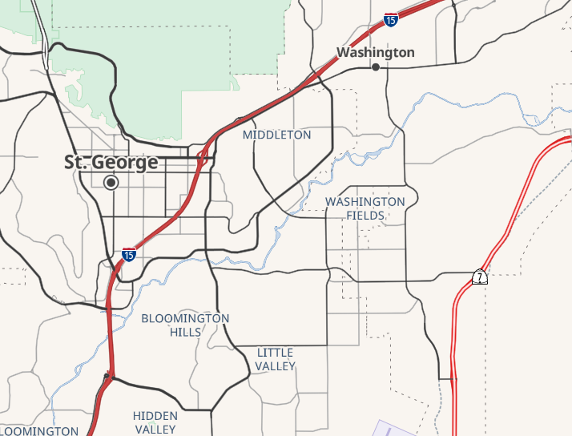
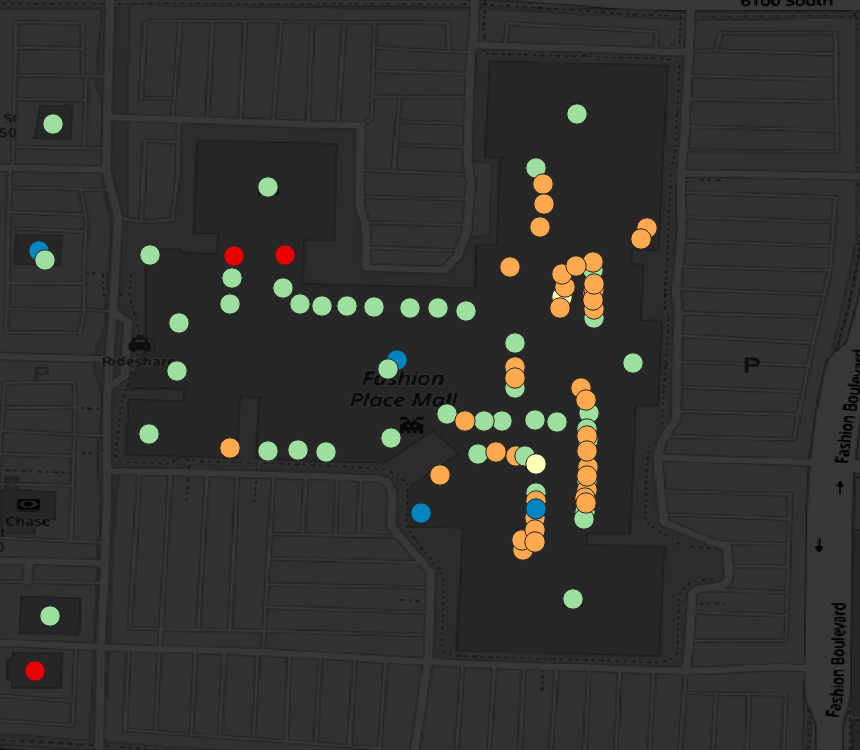
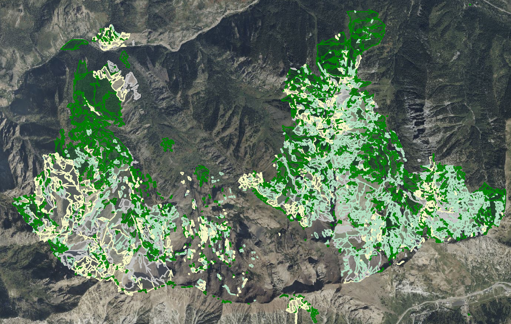
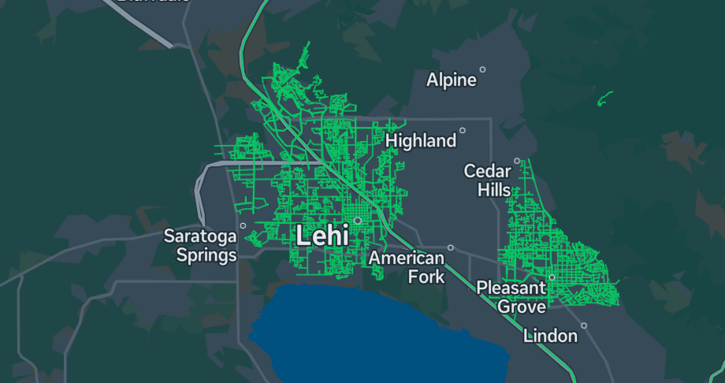
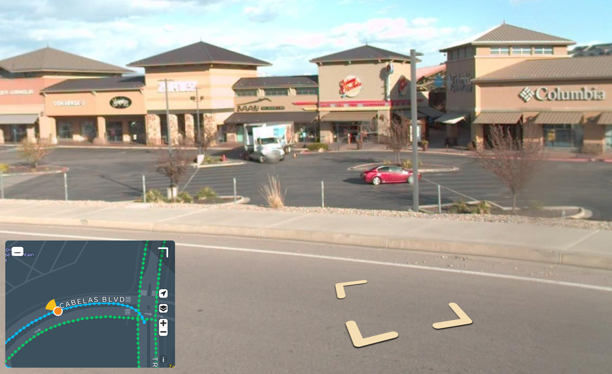

As the days get shorter and the temps drop, we focus our attention on indoor mapping opportunities. Mall Mapping is a great winter surveying activity! We discussed planning a mall mapping session at our regular Map Night. Let's look at the malls we have and which ones need the most mapping!

A good way to look at this is to consider when the shops and restaurants that make up the malls were edited last. Here's an overview. 

*Last edited*

## City Creek

City Creek is Salt Lake City's famously-closed-on-Sundays downtown mall. 

Not terrible but not great either. To the right, where the blue dots (editied within the past year) are, is the food court. I remember spending some time there updating the restaurants while enjoying a chocolate malt from Shake Shack, so that tracks. The main mall area looks like most businesses have been updated between one and two years ago (green), with a few more recent edits.

## Fashion Place Mall

If you want to visit the only Crate & Barrel or Container Store in all of Utah this is your mall. It's nice as far as malls go, and it's open on Sunday.

Looks a little worse, more orange dots, those have not been looked at in at least 3 years! I couldn't help but check - the two red dots represent stores that definitely do not exist anymore. Not going to edit now, where's the fun in that?

## Shops at South Town

Never been, too deep into the suburbs to be convenient, but I hear it's pretty nice as far as malls go. Looks like someone went to town (ha) here somewhere in 2024. 

Checking... Yes, it's our good friend `leftybender` who swept the place in July 2024. He's pretty thorough, but a lot can change in a year and a half in mall land!

## Valley Fair

A bowling center for an "anchor store", that's Valley Fair! Very close to the West Valley Transit Center, so easy to get to (away from) by transit. We actually did a mall mapping party there a few years ago, and it looks like the map could use some new love.

## Other Options

There's a few mall-adjacent places I can think of. 

- Jordan Landing is more of a haphazard collection of big box stores from what I remember - no fun for a mall mapping event if you ask me.
- The Shops at Fort Union is kind of similar to that, I think? The only time I've been there is when In-n-Out burger opened its first location in Utah there and I had to go.
- The Gateway was the hot downtown SLC mall (Apple store and everything) until City Creek opened in the early 2010s. It's been trying to re-invent itself as an entertainment something or other. A shame really, it's a really nice place.
- Other options exist outside of Salt Lake county. Station Park up in Farmington comes to mind. Despite its name, Station park is a foot bridge and a massive parking lot away from the Farmington FrontRunner station. Also, see below, mappers have done a decent job here recently.

## Where will we go?

Discuss #local-utah on the OSM US Slack!
