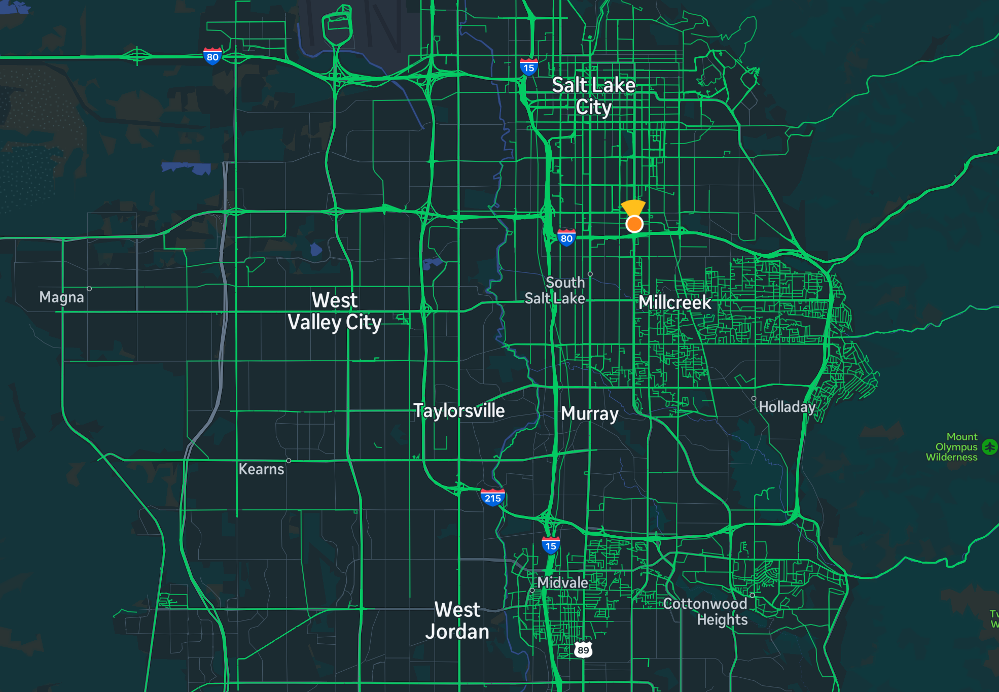
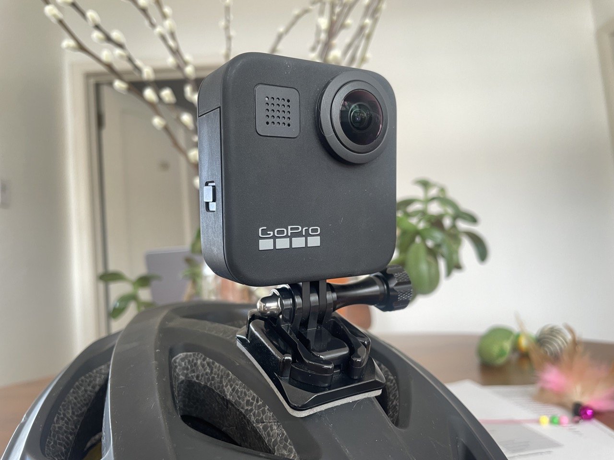

Mapillary is a cool crowdsourced street-level imagery project. Think Google Streetview, but with an open license for the images and pictures taken by people like you and me. I've been an on-and-off contributor for over a decade. The main reason why I do it is that the images can be used for improving OpenStreetMap, the free and open map of the world made, again, by people like you and me.

*OpenStreetMap editing environment showing a Mapillary image*

The simplest way to contribute is to download the app, mount your smartphone on your bike or in your car, and hit record. After you finish recording, the images get uploaded to Mapillary, and a little while later, they will appear on Mapillary.com. There is [an excellent blog post](https://blog.mapillary.com/update/2022/08/31/getting-started-with-mapillary.html) showing you how to get started.

## Mapillary coverage in Utah

Mapillary coverage in Utah is okay. You can check out where we have images on the Mapillary web site. Looking at the Salt Lake City area, we can see a lot of the more important streets covered, and some people have gone in and captured entire neighborhoods systematically.

However, if we look at only images that are less than 2 years old, a lot of this disappears: 

It is also clear that large parts of the Salt Lake Valley, especially on the west side, hardly have any coverage at all.

## How can you help?

It's not hard to get started with Mapillary, but OSM Utah has a few ways to make it even easier and more attractive for you to start helping out. First, OSM Utah owns a **GoPro MAX camera**, a nifty dual-lens action camera that can shoot 360 degree panoramic images that are Mapillary compatible. 

OpenStreetMap Utah members can borrow this camera to use for capturing imagery! We also have some connectors and a "selfie stick" that make it easier to capture while walking or cycling.

We will also start hosting some dedicated Mapillary capturing sessions. These will start with a brief introduction, where we make sure that everyone has their Android or iPhone set up with the app. We will then fan out on foot for 10 minutes, capturing the streets around us. When we get back together, we will upload the images we collected, and do some OSM editing using them! The first session will be on [August 21, during our monthly Map Night at Woodbine Food Hall](https://osmcal.org/event/2936/). See you there!
