We had a very productive year improving OSM in Utah in 2024! Here are some numbers and highlights we would like to share with you.

## Pedestrian Infrastructure

Mappers **added 11,246 km of new sidewalks** and improved a further 4,884 km! In the process, we also **added 13,738 curbs**! A lot of this work is powered by [Rapid](https://rapideditor.org/), the web-based OSM editor that has [gained advanced pedestrian mapping functionality](https://community.openstreetmap.org/t/rapid-v2-5-released-today/123326) recently. 

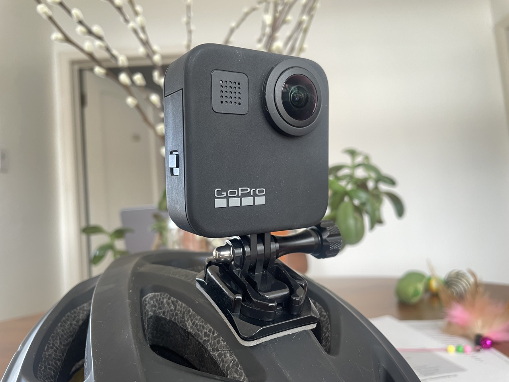

## Roads

The road infrastructure in Utah is already fairly complete, but we are the fastest growing state and new subdivisions and other developments are built everywhere. We **added 3,115 km of road infrastructure** added improved a further  3,186 km. 

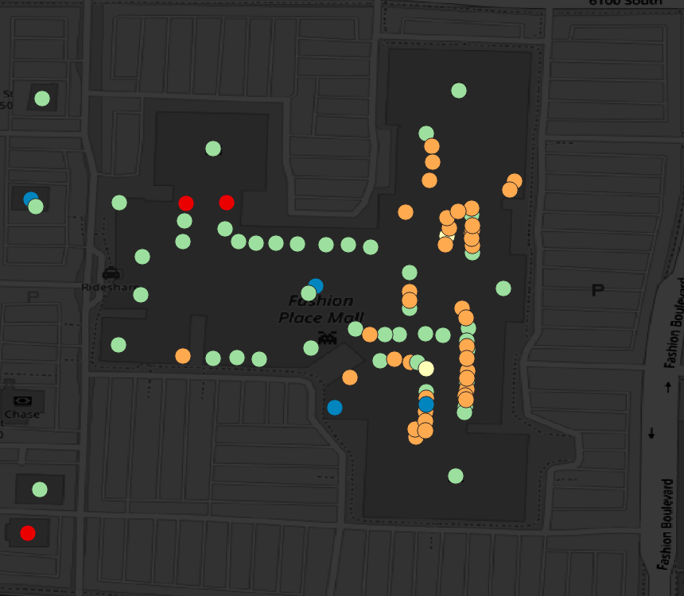

*A new subdivision mapped by `TheConductor` in September. The streets are not even on the latest imagery yet!*

## Buildings

Mapping new buildings has gotten a lot easier in the past years thanks to open buildings datasets from Microsoft and local governments. These are easy to add with the Rapid editor. In total, we mapped no less than **67,998 new buildings** and  improved another 6,139.

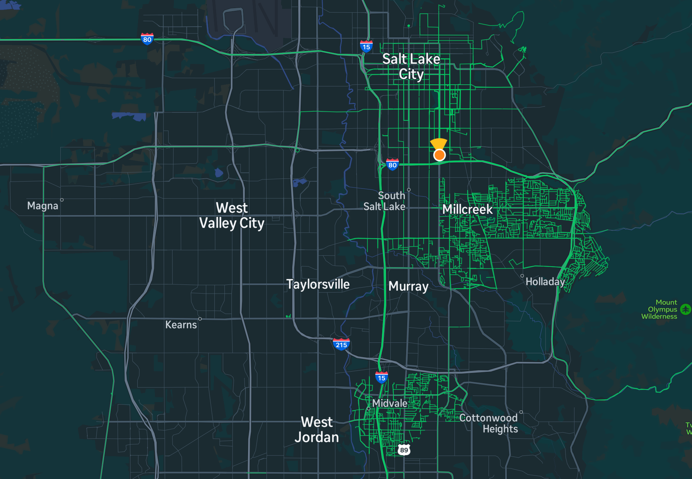

## Points Of Interest

The raw numbers may not look as impressive when we look at points of interest like restaurants, shops, schools and cultural institutions. POIs need local knowledge and "boots on the ground"! Utah mappers delivered. We added 412  new restaurants and other food and drink establishments, and updated 1534 of them. When it comes to POI, updating is arguably even more important than creating! Nobody wants to go to a restaurant only to find that it is closed because the opening hours in OSM were not updated!

We also added 169 new shops and updated 307, added 122 new cultural facilities and updated another 122. We added 10 new educational facilities and updated 208, and added 169 shops and updated another 307.

We would like to thank Mapillary as well! Mapillary offers free and open street level imagery that anyone can contribute to. We [have our own 360° panoramic camera in our OSM Utah community that we lend to mappers](https://new.osmutah.org/community-resources/) who want to use it to capture imagery for Mapillary. 

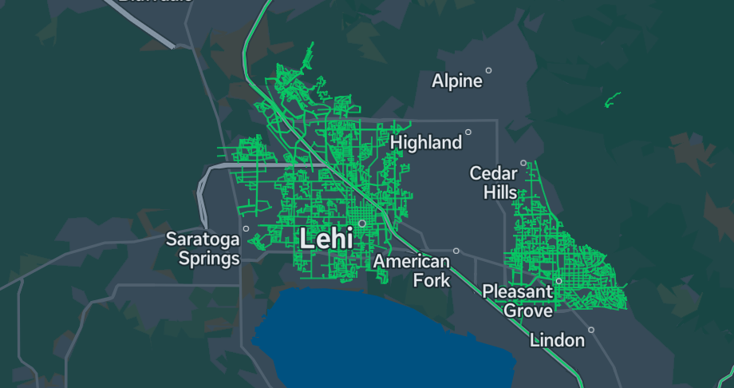

*New 360° Mapillary coverage in Lehi and Pleasant Grove added in 2024*

*Verifying shops and other businesses made easier by fresh Mapillary imagery.*

## The Great Outdoors

Utah is known for its great outdoor recreation opportunities, and our state was also the focus of the OpenStreetMap U.S. [Trails Stewardship Initiative,](https://openstreetmap.us/our-work/trails/) and one of the reasons they chose Salt Lake City as the [venue for State of the Map U.S.](https://openstreetmap.us/events/state-of-the-map-us/2024/) in June!

Mappers created 800km of new hiking trails and improved another 411km. We also added 34,959 natural features, from individual trees to detailed land use outlines.

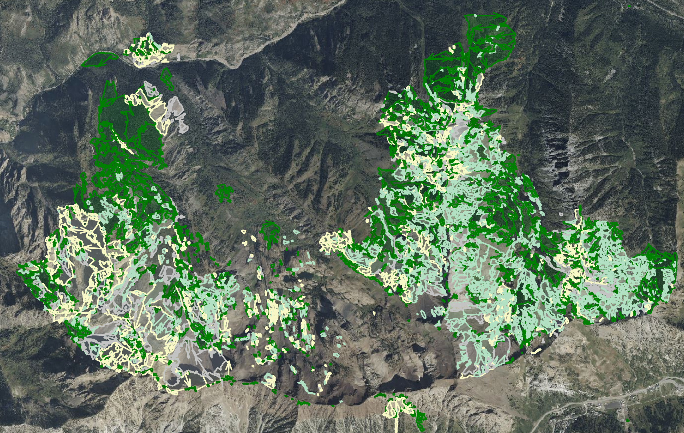

*Some of the incredible land cover detail added by OSM mappers in 2024*

## Thanks!

We would like to say thanks to everyone from outside of Utah who helped us improve the map of our state! 

Thanks also to OpenStreetMap U.S. for their support for local communities and for bringing State of the Map U.S. and the Trails Stewardship Initiative to Utah. 

Thanks to the teams at Rapid and Mapillary who provide our community and communities worldwide with amazing free tools for us to use to map more efficiently!

Finally, a thanks to the folks at [Woodbine Food Hall](https://www.woodbineslc.com/) for hosting us and always serving great food!

### Postscript: How I created these stats

I started by downloading [Utah OSM Data extracts from Geofabrik](https://download.geofabrik.de/north-america/us/utah.html#) for 2024-01-01 and 2025-01-01. Then I ran `osmium derive-changes` to create an OSMChange file that contains the differences between these two extracts, i.e. the edits done in 2024.

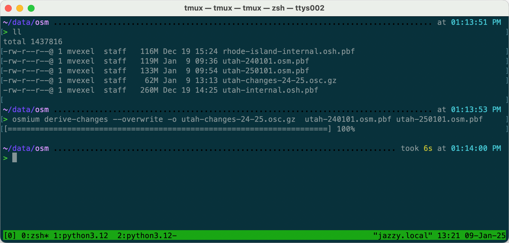

Generating this file just takes a few seconds, the result is 62MB.

JOSM supports loading gzipped OSC files directly, and although this is a lot of data for JOSM to parse, it does work on my 2020 MacBook Pro with 16GB RAM. It does take some time to load and render and it looks fairly messy when zoomed out.

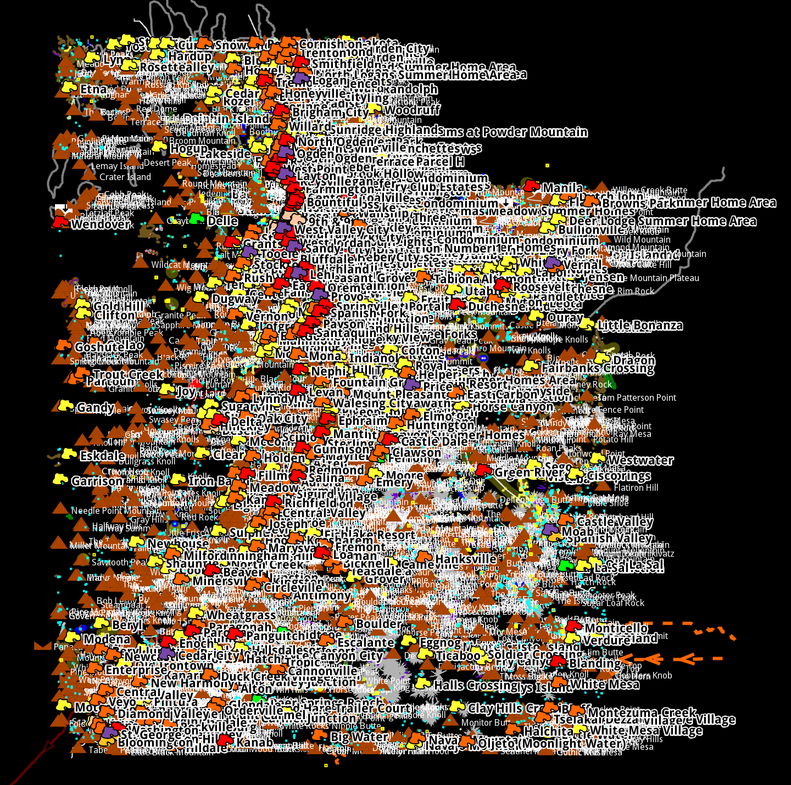

Even though I won't actually need the map display all that much, a few filters make it easier on the eye:

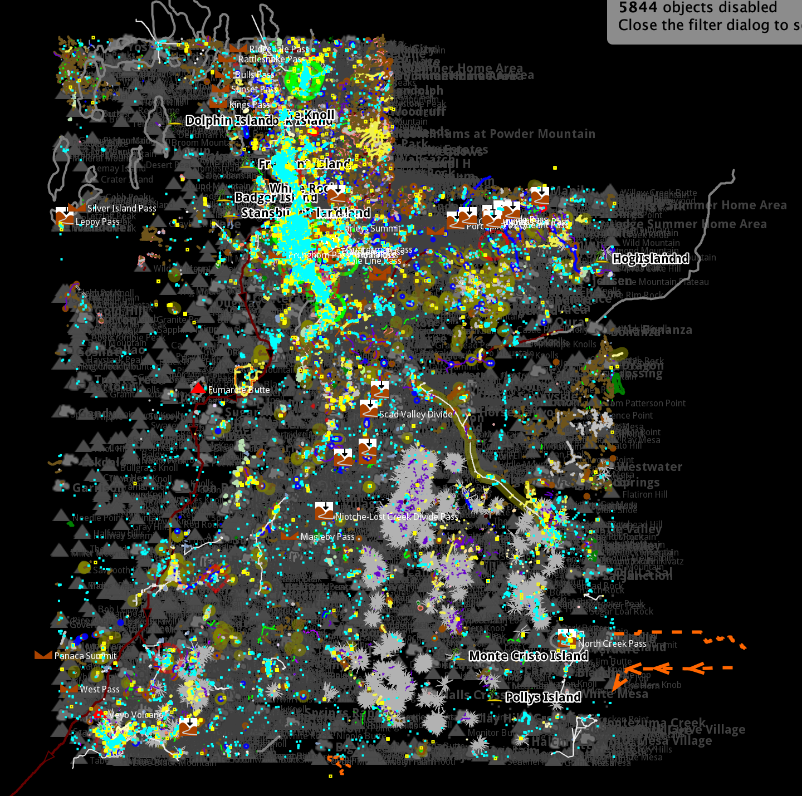

Now, for compiling the metrics, I need the `Measurements` plugin, which gives me measurements for selected objects, like area and length of selected ways.

Now if I want to get for example the length of all new paths added, use the JOSM find dialog:

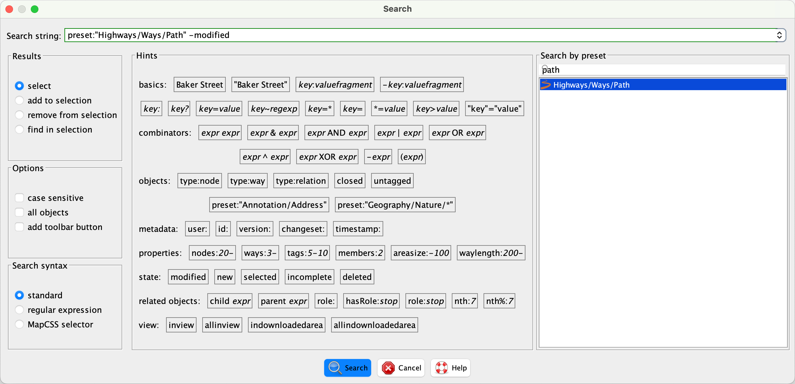

Here, I am using the "Find by preset" function that JOSM offers, in combination with the `modified` flag to just look at the newly added features.

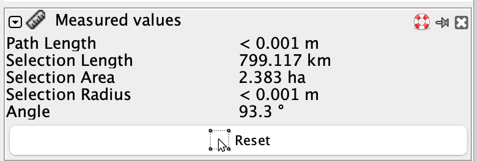

The Measured Values panel, offered by the Measurement plug-in, now shows the sum values for all selected features. I look at the Selection Length for the total length of all new paths. 

For counts, for example for shops, I use the find dialog again:

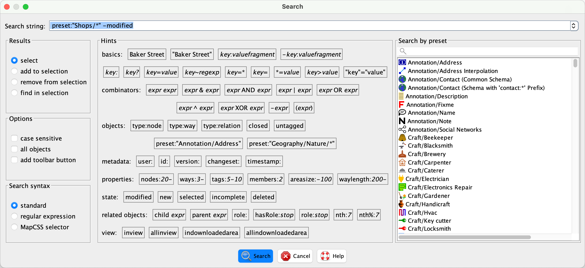

And look at the Selection panel to see the number of selected features:

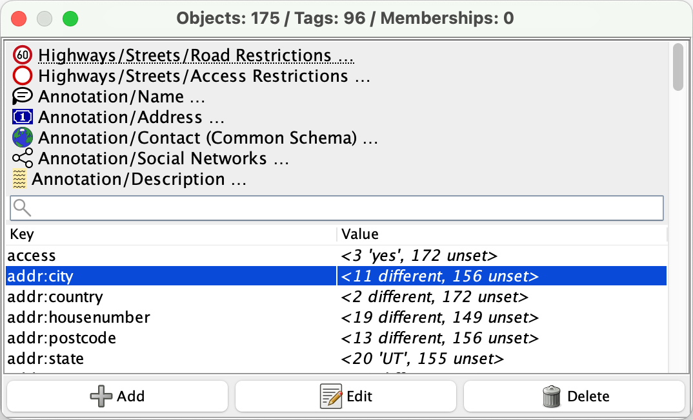
