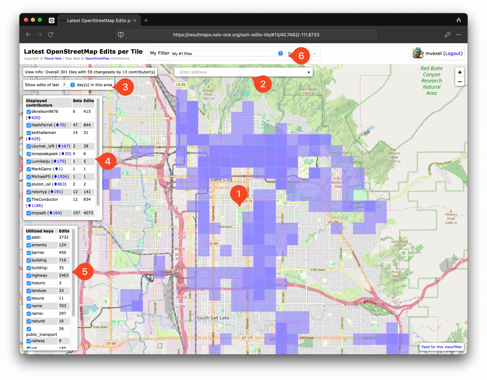
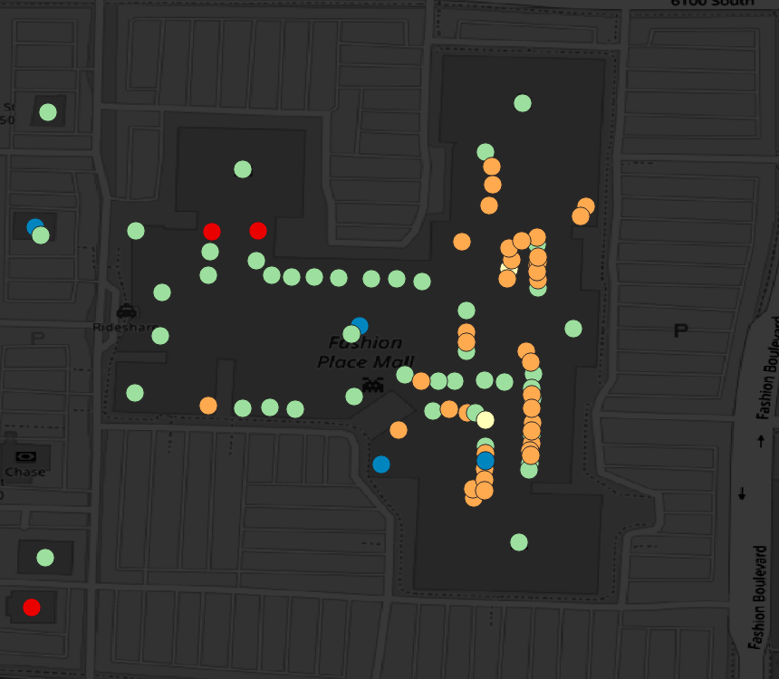

Curious who else is mapping your neck of the woods? The best way is to come to our [monthly map nights](https://new.osmutah.org/our-map-nights/), of course! But did you know that OSM offers really nice tools to show you exactly where OSM has been edited recently, and by who?

The tool for the job in this case is creatively called "**Latest OpenStreetMap Edits per Tile**”. You can find it [here](https://resultmaps.neis-one.org/osm-edits-tile/#13/40.7482/-111.8733) on the web. It may look a little overwhelming at first, but after a little practice it’s actually pretty easy to use! Let’s look at the interface and go over all the important bits. Before we do that though, make sure that you are logged in with your OSM account to make sure you can use all the functionality! There’s a log in button in the top right.

1. The map itself. You can see where edits have been made recently looking at the blue cells. The darker blue, the more edits have been made here. Of course you can zoom and pan the map, but if you zoom out too far, the page starts complaining that you should zoom in. Pro tip: if you have the map pointed at the area you’re most interested in, bookmark it! It will save your place on the map when you pull the bookmark back up.
2. A search bar lets you quickly move the map to a city, town or street
3. You can select how many days of edits you want to see on the map: 1, 3, 7 or 14 days. You will see the map get busier as you select more days as more edits will be included.
4. The app shows you the mappers who have contributed to OSM in the area you see and in the period you selected. They are sorted by number of edits. You can  use the checkbox next to individual mappers to exclude or include them from the overview. A great use of this is to exclude yourself, if you are mainly interested in what other mappers are up to.
5. This is an overview of the tag keys mappers used in their edits. This comes in handy of you’re only interested in, say, highway edits. Unfortunately you cannot filter on specific values for a key, so for example, you can filter on highway but not on highway=footway. There is unfortunately also no quick way to “invert” your selection.
6. You can save any combination of selected mappers and keys in a predefined filter you can save with a name.

I have this app in my bookmarks bar so I can take a peek at what’s happening with the OSM map in Utah! I do wish it would let you zoom out more so you can get a better overview of where mappers are busiest. A way to get around this is to make bookmarks for various places you are interested in. I have one for the Salt Lake City area, one for Capitol Reef National Park, and one for Park City. 

**[Here’s the link again](https://resultmaps.neis-one.org/osm-edits-tile/#13/40.7482/-111.8733)! Happy mapping!**

***Pro Tip! **You can also “subscribe” to edits using a link in the bottom right. This makes use of a system called RSS. Using an RSS reader on the web or your computer, you can get notifications whenever a new changeset appears in the current map view with the current filters. There are plenty of free RSS reader apps available for Linux, Windows and MacOS.*
